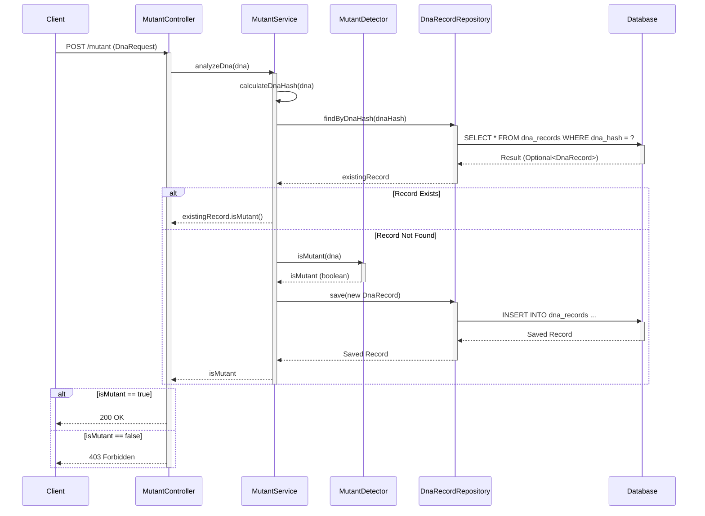

# Sequence Diagram - POST /mutant

```mermaid
sequenceDiagram
    participant Client
    participant MutantController
    participant MutantService
    participant MutantDetector
    participant DnaRecordRepository
    participant Database

    Client->>MutantController: POST /mutant (DnaRequest)
    activate MutantController
    
    MutantController->>MutantService: analyzeDna(dna)
    activate MutantService
    
    MutantService->>MutantService: calculateDnaHash(dna)
    
    MutantService->>DnaRecordRepository: findByDnaHash(dnaHash)
    activate DnaRecordRepository
    DnaRecordRepository->>Database: SELECT * FROM dna_records WHERE dna_hash = ?
    activate Database
    Database-->>DnaRecordRepository: Result (Optional<DnaRecord>)
    deactivate Database
    DnaRecordRepository-->>MutantService: existingRecord
    deactivate DnaRecordRepository
    
    alt Record Exists
        MutantService-->>MutantController: existingRecord.isMutant()
    else Record Not Found
        MutantService->>MutantDetector: isMutant(dna)
        activate MutantDetector
        MutantDetector-->>MutantService: isMutant (boolean)
        deactivate MutantDetector
        
        MutantService->>DnaRecordRepository: save(new DnaRecord)
        activate DnaRecordRepository
        DnaRecordRepository->>Database: INSERT INTO dna_records ...
        activate Database
        Database-->>DnaRecordRepository: Saved Record
        deactivate Database
        DnaRecordRepository-->>MutantService: Saved Record
        deactivate DnaRecordRepository
        
        MutantService-->>MutantController: isMutant
    end
    
    deactivate MutantService
    
    alt isMutant == true
        MutantController-->>Client: 200 OK
    else isMutant == false
        MutantController-->>Client: 403 Forbidden
    end
    
    deactivate MutantController
```
