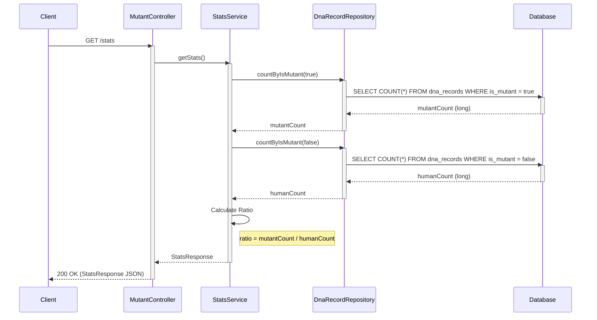

# Sequence Diagram - GET /stats

```mermaid
sequenceDiagram
    participant Client
    participant MutantController
    participant StatsService
    participant DnaRecordRepository
    participant Database

    Client->>MutantController: GET /stats
    activate MutantController
    
    MutantController->>StatsService: getStats()
    activate StatsService
    
    StatsService->>DnaRecordRepository: countByIsMutant(true)
    activate DnaRecordRepository
    DnaRecordRepository->>Database: SELECT COUNT(*) FROM dna_records WHERE is_mutant = true
    activate Database
    Database-->>DnaRecordRepository: mutantCount (long)
    deactivate Database
    DnaRecordRepository-->>StatsService: mutantCount
    deactivate DnaRecordRepository
    
    StatsService->>DnaRecordRepository: countByIsMutant(false)
    activate DnaRecordRepository
    DnaRecordRepository->>Database: SELECT COUNT(*) FROM dna_records WHERE is_mutant = false
    activate Database
    Database-->>DnaRecordRepository: humanCount (long)
    deactivate Database
    DnaRecordRepository-->>StatsService: humanCount
    deactivate DnaRecordRepository
    
    StatsService->>StatsService: Calculate Ratio
    Note right of StatsService: ratio = mutantCount / humanCount
    
    StatsService-->>MutantController: StatsResponse
    deactivate StatsService
    
    MutantController-->>Client: 200 OK (StatsResponse JSON)
    deactivate MutantController
```
